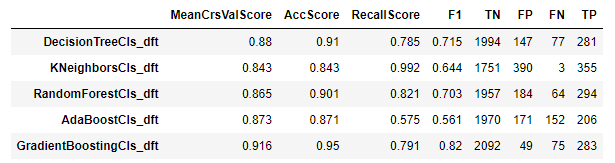

# Phase 3 Project

## Project Overview

In this project, I chosen [SyriaTel Customer Churn](https://www.kaggle.com/becksddf/churn-in-telecoms-dataset) to solve a binary classification problem. 

Based on the classification results and features analysis, some suggestions regarding specific aspects of the customers will be given to decease the churn rate 

## Business Problem

* Q: Who are the stakeholders in this project? Who will be directly affected by the creation of this project?
* A: The stakeholder is the SyriaTel, a telecommunications company. 
* Q: What business problem(s) will this Data Science project solve for the organization?
* A: 1) Who will be stick on the company and who will stop doing business with the company based on data analysis
       and classification models performed.
     2) Based on identified patterns, suggestions in different aspects could be given to the company for keeping 
        the customers stick on the company

### The Data

The data is [SyriaTel Customer Churn](https://www.kaggle.com/becksddf/churn-in-telecoms-dataset) with the file bigml_59c28831336c6604c800002a.csv, which has been saved in the folder: /data/

### Methods

#### First, I loaded data to check the potential features, and found:

1) There are 20 features and one target, i.e., churn, and no missing data from all columns
2) A total of 3333 entries
3) Data types of several columns need to be changed 

#### Second, I prepared the data:

1) the column names: replace ' ' with '_'
2) the column 'phone number': drop it since it generally does not affect the customer churn
3) the column 'international_plan' and 'voice_mail_plan': replace 'yes' and 'no' with 1 and 0
4) the target column 'churn': convert boolean into int, and I also found the target is imbalanced: 0-2850 entries,1-483 entries

#### Third, I examined the features one-by-one:

1) 'account_length': a normal distribution and in the unit of day 

2) 'area_code': the churn rates are similar across three unique area codes, therefore, this feature can be excluded from classification

3) 'state': different states have different churn rate, CA and NJ are the two highest churn rate states > 25%,
 while AK and HI are the two lowest churn rate states < 6%

4) 'international_plan' and 'voice_mail_plan': the customers with international plan but without voice mail plan have higher churn rate

5) 'number_vmail_messages': This feature seems not well sampled, since there are too many customers in the survey has 0 number of voice messages. Meanwhile, this feature also have some relationship with the churn rate

6) 'customer_service_calls': the customers with number of service calls as 4,5,6 have larger churn rate, while less than 4 are likely to drop

7) The remaining features related to calls and charges within four different categories: day, eve, night, intl, might have high correlation. I found the minutes and charge in each category has close to 1 correlation.so I will drop the columns of charge in the following classification models

### Modeling

#### Prepare train and test data

After examining all features, I prepare the train and test data:
- The target is the churn column
- The features are all columns after excluding   churn','area_code','total_day_charge','total_eve_charge','total_night_charge','total_intl_charge'
- For 'state', I will do oneHotEncoder for both X_train and X_test
- Split data into train and test part
- Since churn== 1 is signficantly smaller than churn==0,i.e., 358 vs. 2141, I will use SMOTE oversampling

#### Build a baseline model using decision tree

The performance of the baseline model is: 
      - confusion matrix: 
         [[1997  144]
         [  78  280]]
      - accuracy_score:  0.911
      - f1_score:  0.716
      - recall_score:  0.782
      not bad
      
The importance of each feature is shown in the following figure: three features are the most important ones
- customer_service_calls
- total_day_minutes
- international_plan

take a look total_day_minutes: total day minutes > 315.6, churn rate is 100%, and total day minutes < 46.5, churn rate is mostly 0

#### Classification Model Comparisons using different classifiers
- DecisonTreeClassifier
- KNeighborsClassifier
- RandomForestClassifier
- AdaBoostClassifier
- GradientBoostingClassifier

the performance is shown as:

The GradientBoostingClassifier achieves the best results, So I will use this model in the following analysis

Based on its intial parameters, I used gridsearch to find the optimal parameters

param_grid = {
    "loss":["exponential", "deviance"],
    "learning_rate": [0.01,0.1,0.2],
    "min_samples_split": [2,5],
    "min_samples_leaf":[1,2,5],
    'max_depth':[3,5]
    }
    
And the obtained best parameters are:
{'learning_rate': 0.1, 'loss': 'deviance', 'max_depth': 5, 'min_samples_leaf': 1, 'min_samples_split': 2} 

and achieved the results as:

GradientBoostingClassifier final:
confusion matrix: 
 [[2135    6]
 [  40  318]]
accuracy_score:  0.982
recall_score:  0.888
f1_score:  0.933

This result is pretty good, so I will use it as the final model to do the test.

#### Final model with GradientBoostingClassifier

- Parameters:
-loss = 'deviance'
-learning_rate = 0.1
-min_samples_leaf = 1
-min_samples_split = 2
-max_depth = 5
-SMOTE balancing
-StandardScaler

The performance on training and test data are:

Final model for train data:
accuracy_score:  0.98
recall_score:  0.88
f1_score:  0.926

Final model for test data:
accuracy_score:  0.944
recall_score:  0.736
f1_score:  0.797

and the feature importance for the final model is

## Summary

From the classification models, I found that three features affected the customer churn rate most significantly:
- customer_service_calls: The customers with large number of service calls as 4,5,6 seems have the larger churn rate
- international_plan: The customers with international plan have the higher churn rate
- total_day_minutes: The customers with the total day minutes > 315.6, churn rate is 100%, and total day minutes < 46.5, churn rate is mostly 0, therefore, the company need to deal with the customers with the total day minutes     between 46.5 to 316 mins

Regarding states: AZ, AK and HI have the lowest churn rate states, therefore, need to pay more attention on customers from these states
